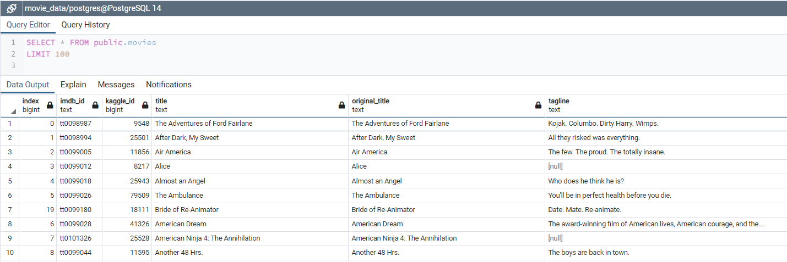

# Amazing Prime

## Overview of Project
---

Amazing Prime is the world's leading online retailer's TV and movie streaming platform. Our team would like to develop an algorithm to identify which low budget movies will become popular so that we can purchase the streaming rights at a bargain. In an effort to have a little fun and gain excitement from the local coding community, we have decided to host a hack-a-thon, asking participants to predict the popular movies. 

## Purpose
---

I have been tasked with creating the clean datasets that will be used in the upcoming hack-a-thon. our information comes from two distinct sources. 

    1. A scrape from Wikipedia for all movies since 1990.
    2. Movie rating data from the MovieLens website.

The goal was to clean and transform this data into one clean dataset and load it into a SQL database for easy access during the hack-a-thon.

### Cleaning the Data
---
Initially, the Wikipedia data loaded into a DataFrame with 190+ columns. The below function handled the bulk of our cleaning needed to be done after removing any lines in the DataFrame that were not movies. in the end we were able to trim this Wikipedia data down to a manageable 21 columns.

### Merging the Data
---
After also cleaning the MovieLens similar to the Wikipedia data, I merged the two DataFrames and noticed that there were several columns with overlapping information. Deep-diving into each column, a decision was made and documented in the image below on which columns to use.

### Loading the Data
---
Finally, I loaded the DataFrames into an SQL Database. The below images are samples of the cleaned tables ready for use in the hack-a-thon.

### Summary
---

While this project had it's difficulties being based on a lot of wikipedia data, in the end the function created for this project will be useful if the same inquiry needed to be run again in the future. This SQL Database will be of great use to the hack-a-thon and in the end will result in better business decisions made for Amazing Prime as a whole.